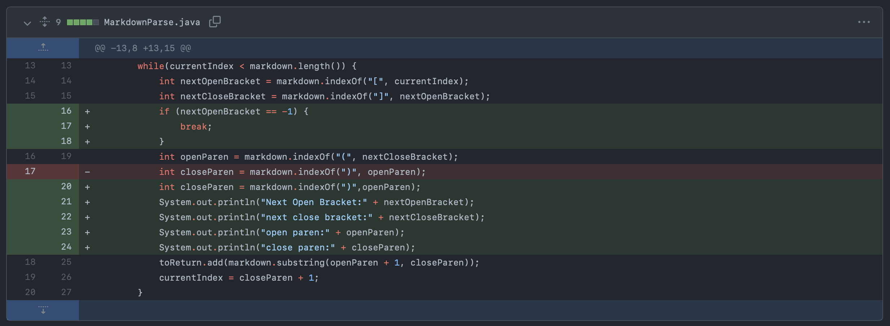
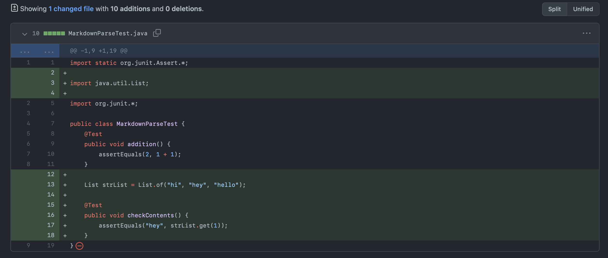
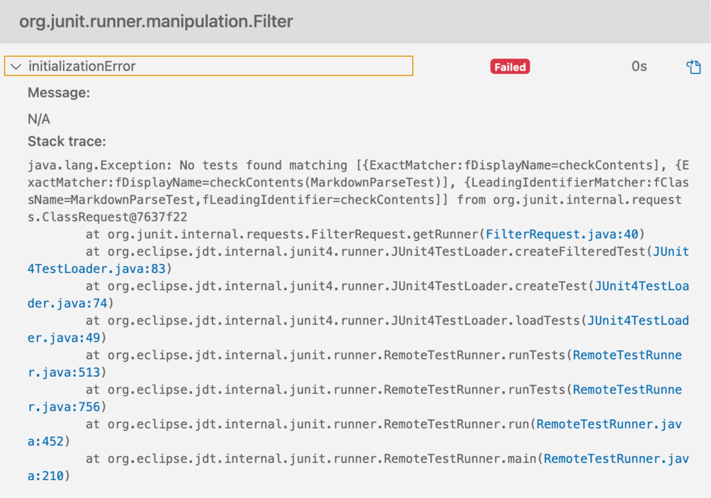
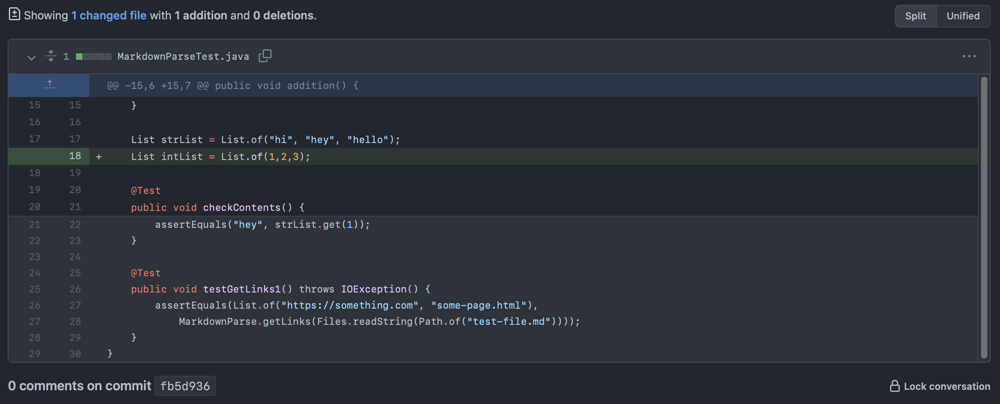
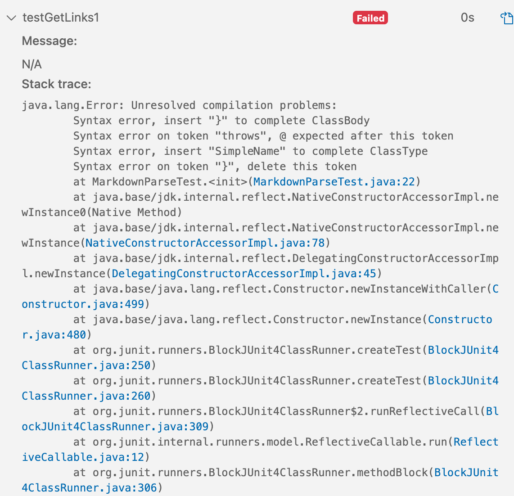

[back to homepage](index.md)

# Lab Report 2

**Code Change 1:**

Link to the test file for *failure-inducing input*: [Link](test-file3.md)

Output of running the file for the version where it was failing:

`Exception in thread "main" java.lang.OutOfMemoryError: Java heap space
        at java.base/java.util.Arrays.copyOf(Arrays.java:3511)
        at java.base/java.util.Arrays.copyOf(Arrays.java:3480)
        at java.base/java.util.ArrayList.grow(ArrayList.java:237)
        at java.base/java.util.ArrayList.grow(ArrayList.java:244)
        at java.base/java.util.ArrayList.add(ArrayList.java:454)
        at java.base/java.util.ArrayList.add(ArrayList.java:467)
        at MarkdownParse.getLinks(MarkdownParse.java:27)
        at MarkdownParse.main(MarkdownParse.java:35)`

 

The failure-inducing input caused the bug in my code to come to light, and caused the symptom of the input to occur. The failure-inducing input was that the link had parentheses within it, which caused the bug to come out that my code wasn't equipped to handle parentheses in the link. This showed the symptom of my code going into an infinite loop and causing Java to return an `OutOfMemoryError`.

 

**Code Change 2:**

 

Link to the test file for *failure-inducing input*: [Link](MarkdownParseTest.java)

 

Output of running the file for the version where it was failing:

 

The failure-inducing input, in this case, would have been any test that I did because, no matter the input, my code would've failed because of the bug in my code. The bug in my code was that I put in parameters for the `checkContents()` method in my code, which I should not have done because the return type is `void`. Putting parameters in the method header caused the `initializationError` symptom.

 

**Code Change 3:**

 

Link to the test file for *failure-inducing input*: [Link](MarkdownParseTest.java)

 

Output of running the file for the version where it was failing:

The failure-inducing input would have also been any input in this case because of the bug in my code. The bug was that there are `()` at the end of `IOException` when there should not be, which caused the `Unresolved compilation problems` symptom.