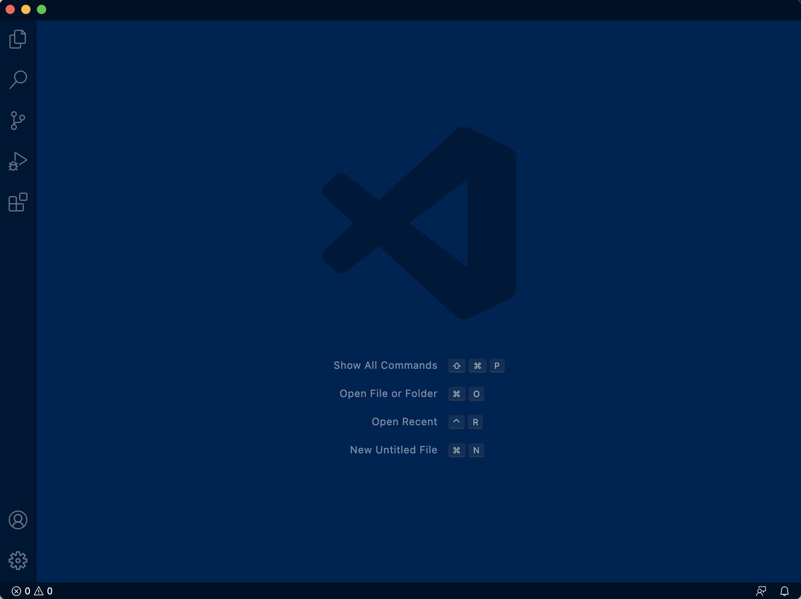

# Welcome To CSE15L Students! 
# My name is Lauren!

 

## I will be teaching you how to log into a course-specific account on ieng6.

 

## Let's get started:

1. Install Visual Studio Code

 

Go to the VScode website [VScodeDownload](https://code.visualstudio.com/download) and follow the instructions on how to install VScode.

 

Once you've done that, when you open up VScode, it should look something like this:

 

 
 

2. Remotely Connecting

 

**Only if you're on Windows:**
 
You need to download a program called [OpenSSH](https://docs.microsoft.com/en-us/windows-server/administration/openssh/openssh_install_firstuse), which allows you to connect your computer to other computers with this kind of account.

 

Then, go [here](https://sdacs.ucsd.edu/~icc/index.php) to look up your course-specific account for CSE15L.
