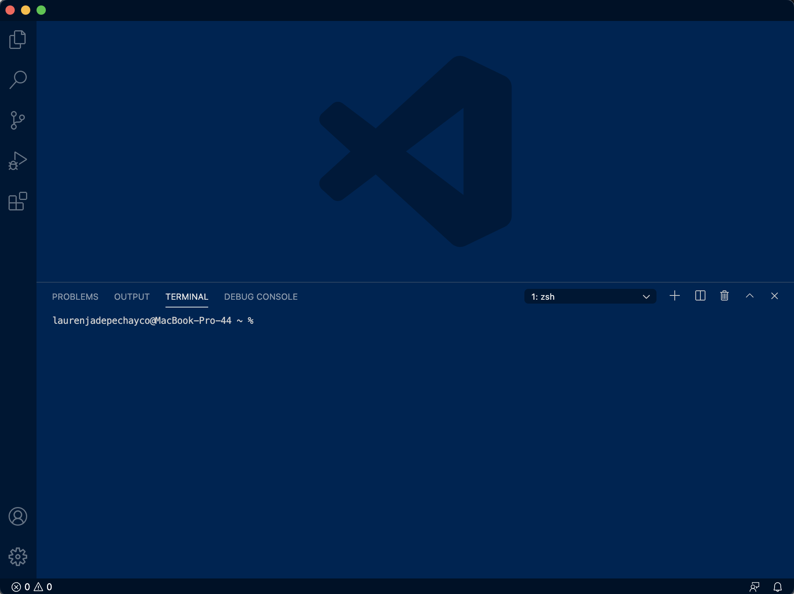
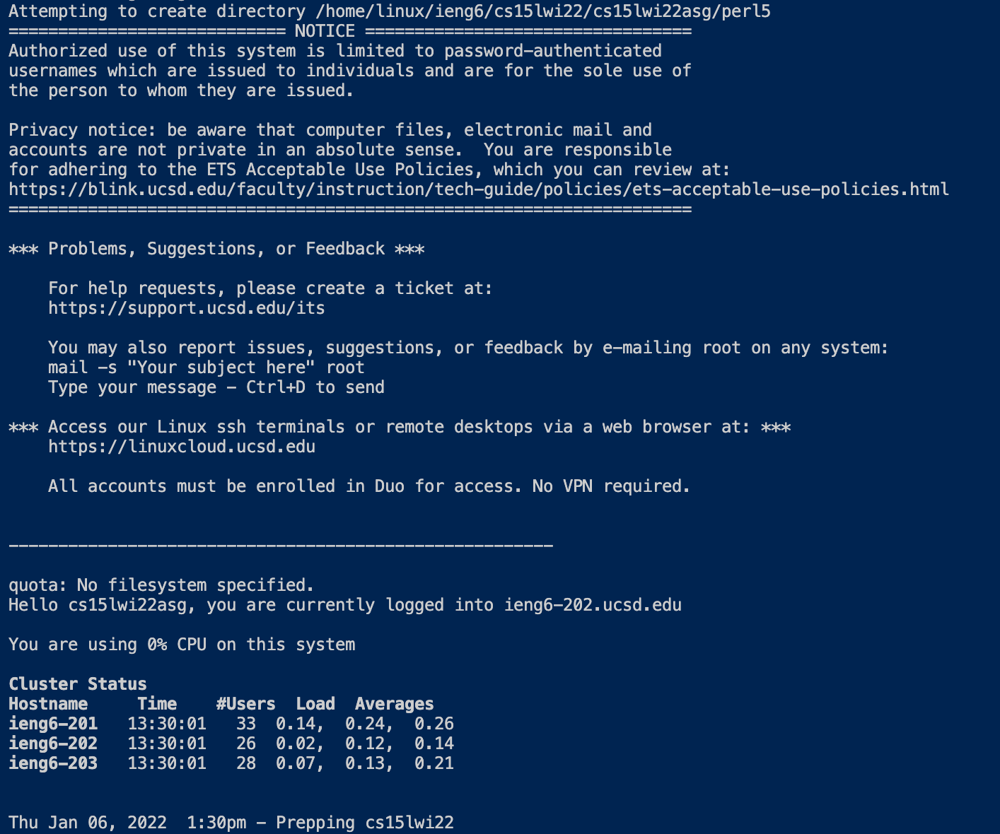

# Welcome CSE15L Students! 
# My name is Lauren!

 

## I will be teaching you how to log into a course-specific account on ieng6.

 

## Let's get started:

1) Install Visual Studio Code

 

Go to the VScode website [VScodeDownload](https://code.visualstudio.com/download) and follow the instructions on how to install VScode.

 

Once you've done that, when you open up VScode, it should look something like this:

 

 
 

2) Remotely Connecting

 

**Only if you're on Windows:**
 
You need to download a program called [OpenSSH](https://docs.microsoft.com/en-us/windows-server/administration/openssh/openssh_install_firstuse), which allows you to connect your computer to other computers with this kind of account.

 

Then, go [here](https://sdacs.ucsd.edu/~icc/index.php) to look up your course-specific account for CSE15L.

 

Now, open VScode and open a new terminal by either: Ctrl or Command + `, or use the Terminal → New Terminal menu option, or by clicking the symbols in the bottom left corner.
 

The terminal should look something like this: 

 

 

Now, you should enter your course-specific account information in the terminal. Type "ssh" followed by your specific information. It should look something like this:

 

 

Press enter and if this is the first time you are connecting to the server, you will likely get a message like this:

 

 

Simply type "yes" and press enter, then input your password. Once you're logged in, the whole interaction should look something like this:

 

 

Yay! Now your terminal is connected to a computer in the CSE basement, and any commands you run on your local computer will run on that computer. 
 
Your computer is the *client* and the computer in the basement is the *server*. 

 

Here is another example of what your log-in should look like:

 

 

3) Trying Some Commands

Once you are logged in, try some commands!

 

Here are some useful commands:

 

 

Enter any of these into the terminal. Here is an example of using "ls-lat".

 

