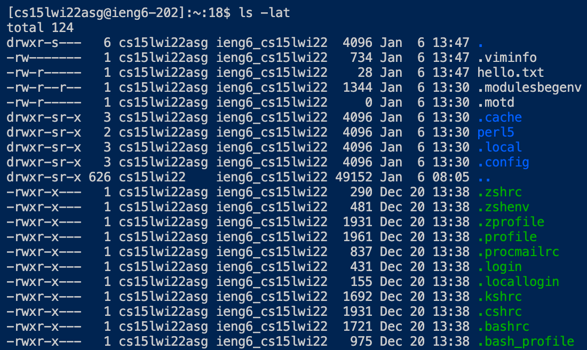
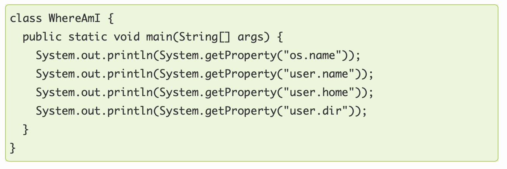
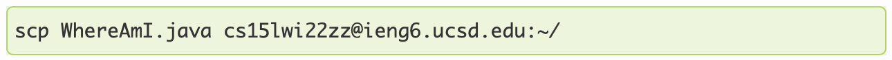
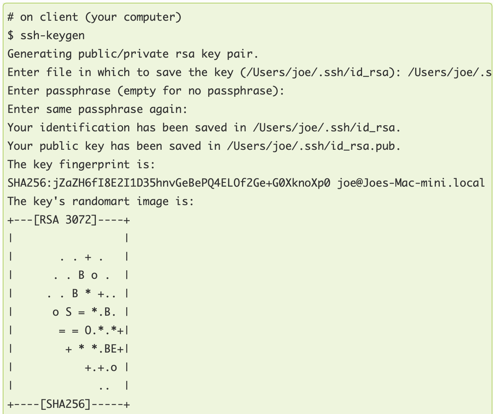
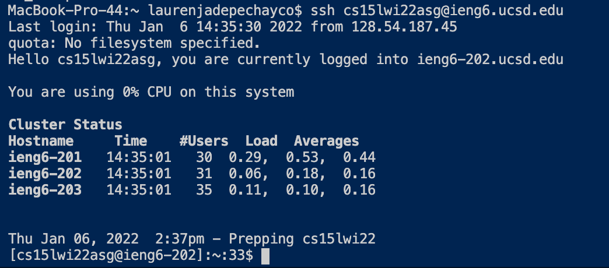
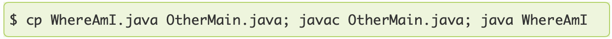
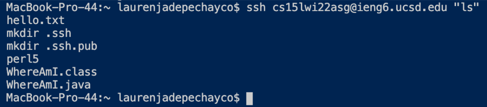

# Welcome CSE15L Students! 
# My name is Lauren!

 

## I will be teaching you how to log into a course-specific account on ieng6.

 

## Let's get started:

**1) Install Visual Studio Code**

 

Go to the VScode website [VScodeDownload](https://code.visualstudio.com/download) and follow the instructions on how to install VScode.

 

Once you've done that, when you open up VScode, it should look something like this:

 

 
 

**2) Remotely Connecting**

 

**Only if you're on Windows:**
 
You need to download a program called [OpenSSH](https://docs.microsoft.com/en-us/windows-server/administration/openssh/openssh_install_firstuse), which allows you to connect your computer to other computers with this kind of account.

 

Then, go [here](https://sdacs.ucsd.edu/~icc/index.php) to look up your course-specific account for CSE15L.

 

Now, open VScode and open a new terminal by either: Ctrl or Command + `, or use the Terminal → New Terminal menu option, or by clicking the symbols in the bottom left corner.
 

The terminal should look something like this: 

 

 

Now, you should enter your course-specific account information in the terminal. Type "ssh" followed by your specific information. It should look something like this:

 

 

Press enter and if this is the first time you are connecting to the server, you will likely get a message like this:

 

 

Simply type "yes" and press enter, then input your password. Once you're logged in, the whole interaction should look something like this:

 

 

Yay! Now your terminal is connected to a computer in the CSE basement, and any commands you run on your local computer will run on that computer. 
 
Your computer is the *client* and the computer in the basement is the *server*. 

 

Here is another example of what your log-in should look like:

 

 

**3) Trying Some Commands**

Once you are logged in, try some commands!

 

Here are some useful commands:

 

 

Enter any of these into the terminal. Here is an example of using "ls-lat".

 

 

**NOTE: To log out of the remote server, either press Ctrl-D or type "exit" into the terminal.**

 

**4) Moving Files over SSH with scp**

 

It is very useful to be able to copy files from your computer to a remote computer. The command to do this is called "scp", and it is always run from the client (your local computer, not connected to ieng6).

 

To test this command, make a sample file to copy. I made a file called "WhereAmI.java" and put the following contents into it:

 

 

Then, in the terminal, you should follow this format to run the command:

 

 

Here is a screenshot of running the scp command, then logging into the server and running the "ls" command to check that the file was indeed copied over:

 

 

**5) Setting an SSH key**

Every time we log in, we have to retype or copy-paste our password. This can be time-consuming and inefficient. Thankfully, there's a solution: ssh keys!

The idea behind ssh keys is that a program called ssh-keygen creates a pair of files called the *public key* and the *private key*. Essentially, you make a public key on the server and a private key on the client, and when the ssh command is run, it can use the pair of files in place of your password.

Follow this guide to set up your ssh key:

 

**Only if you're on Windows:**

Follow the extra "ssh-add" step [here](https://docs.microsoft.com/en-us/windows-server/administration/openssh/openssh_keymanagement#user-key-generation).

 

Following the set up above created two new files:

the private key: in file "id_rsa"

the public key: in file "id_rsa.pub"

 

Now, copy the public key to the .ssh directory of your user account on the server by following these steps:

 

Once you've completed these steps, just use the "ssh" command like normal and you should be able to log in without having to input your password. It should look something like this:

 

6) Optimizing Remote Running

 

There are many ways to make running commands in the terminal faster and more efficient. 

For example, you can write a command in quotes after the ssh command to run that command directly and immediately log out of the server afterward.

 

Another example is to use semicolons to run multiple commands on the same line. 

 

Here is an example of the result of running the "ls" command with the ssh command:

 

Feel free to try out different combinations and commands to optimize your remote running!

## Hope you enjoyed the tutorial!