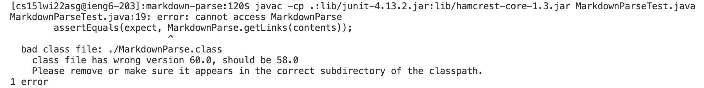
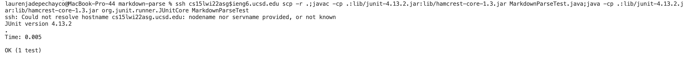

[back to homepage](index.md)

# Lab Report 3

<br />

## Copying Whole Directories with ```scp -r```

<br />


<br />

Here I am copying the whole markdown-parse-main directory to my ieng6 account using the command:

```
$ scp -r . cs15lwi22asg@ieng6.ucsd.edu:~/markdown-parse
```

Then, I am logging into my ieng6 account and using the ```ls``` command to show that the whole directory was indeed copied over.

<br />

*issue*



<br />

For some reason, when I try to compile my MarkdownParseTest.java file on ieng6, it keeps giving me this error.

<br />



<br />

Here I am logging into my ieng6 account, copying the whole directory, and compiling and running the tests all in one line.

<br />

[back to homepage](index.md)