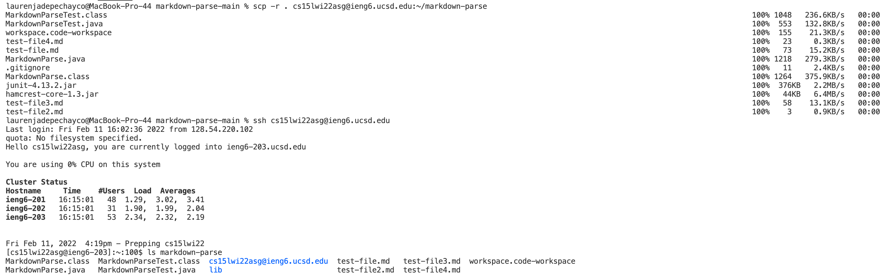

[back to homepage](index.md)

# Lab Report 3

<br />

## Copying Whole Directories with ```scp -r```



Here I am copying the whole markdown-parse-main directory to my ieng6 account using the command:

```
$ scp -r . cs15lwi22asg@ieng6.ucsd.edu:~/markdown-parse
```

Then, I am logging into my ieng6 account and using the ```ls``` command to show that the whole directory was indeed copied over.

