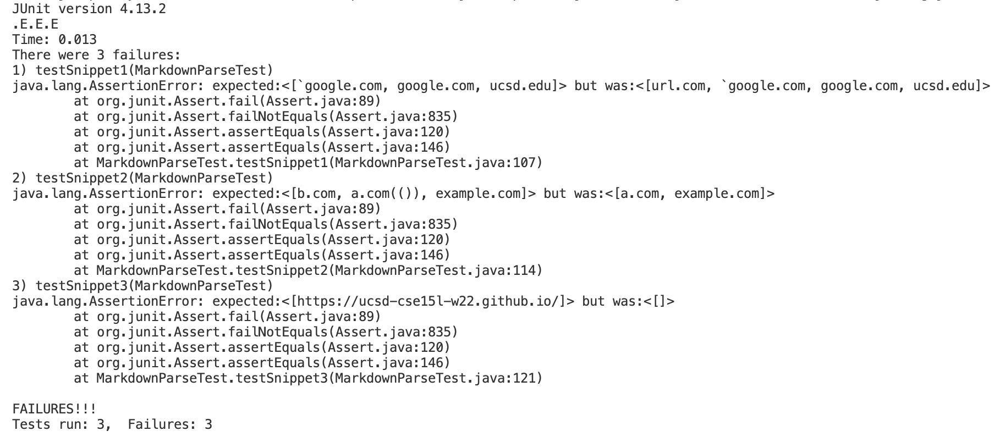

[back to homepage](index.md)

# Lab Report 4

<br />

## Analyzing Snippets of Code Using Different Implementations

<br />

The link to my group's repository: [https://github.com/sallada1/markdown-parse](https://github.com/sallada1/markdown-parse)

The link to the repository that my group reviewed: [https://github.com/pvijay03/markdown-parse](https://github.com/pvijay03/markdown-parse)

<br />

Here are the snippets of code that we are analyzing:

## Snippet 1
```
`[a link`](url.com)

[another link](`google.com)`

[`cod[e`](google.com)

[`code]`](ucsd.edu)
```

## Snippet 2
```
[a [nested link](a.com)](b.com)

[a nested parenthesized url](a.com(()))

[some escaped \[ brackets \]](example.com)
```

## Snippet 3
```
[this title text is really long and takes up more than 
one line

and has some line breaks](
    https://www.twitter.com
)

[this title text is really long and takes up more than 
one line](
    https://ucsd-cse15l-w22.github.io/
)


[this link doesn't have a closing parenthesis](github.com

And there's still some more text after that.

[this link doesn't have a closing parenthesis for a while](https://cse.ucsd.edu/


)

And then there's more text
```

<br />

## Snippet 1 Expected Output:

```
[`google.com, google.com, ucsd.edu]
```

<br />

## Snippet 2 Expected Output:

```
[b.com, a.com(()), example.com]
```

## Snippet 3 Expected Output:

```
[https://ucsd-cse15l-w22.github.io/]
```

<br />

Here is how I made the tests for the snippets using the code from the group that we reviewed:


<br />

Here is how I made the tests for the snippets using my group's code:


<br />

The output for my group's implementation: (unfortunately, all 3 tests failed)


<br />

The output for the code of the group that we reviewed: (unfortunately, all 3 tests also failed)



<br />

**Do you think there is a small (<10 lines) code change that will make your program work for snippet 1 and all related cases that use inline code with backticks? If yes, describe the code change. If not, describe why it would be a more involved change.**

<br />

Yes, I believe that there is a small code change that could fix my program to work for snippet 1. The issue with snippet 1 is that the backticks are confusing the program, so I believe including an if-statement to watch for backticks would fix the program. The if-statement would be less than 10 lines and could just go at the beginning of the method.

<br />

**Do you think there is a small (<10 lines) code change that will make your program work for snippet 2 and all related cases that nest parentheses, brackets, and escaped brackets? If yes, describe the code change. If not, describe why it would be a more involved change.**

<br />

No, I do not believe that there is a small code change that will make my program work for snippet 2. In snippet 2, the problem is that there are several extra brackets, parentheses, and backslashes that are confusing the program. Therefore, there would most likely have to be many if-statements included, or even just a huge code change in general changing the way the code sets the different variables. Therefore, I believe the code change would be a lot more involved.

<br />

**Do you think there is a small (<10 lines) code change that will make your program work for snippet 3 and all related cases that have newlines in brackets and parentheses? If yes, describe the code change. If not, describe why it would be a more involved change.**

<br />

Yes, I believe that there is a small code change that will make my program work for snippet 3. In snippet 3, the issue is that the code isn't correctly setting the parentheses variables and isn't correctly trimming the white space. Therefore, I think just fixing the code so that the parentheses variables are updated properly and using the method that automatically trims white space would help fix my program.

<br />

[back to homepage](index.md)