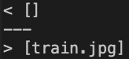
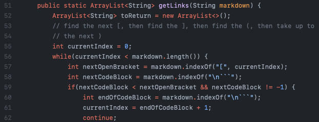
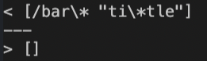
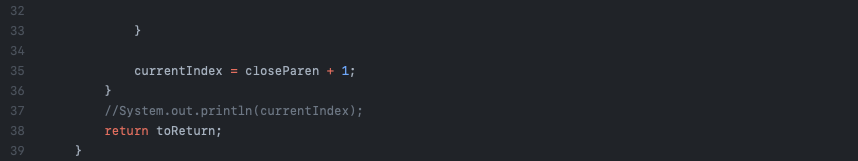

[back to homepage](index.md)

# Lab Report 5

<br />

## Analyzing Different Tests and Coding Implementations of Markdown-Parse

<br />

## Different Implementation #1

<br />



Here is an example of where the output is different for the two implementations. I used ```diff``` followed by the ```results.txt``` output to spot the differences in output between the two. 

<br />

For this test, my implementation is correct because *train.jpg* is supposed to be an image, not a link. My implementation produced ```[]```, while the other implementation produced ```[train.jpg]```, therefore, mine is correct because *train.jpg* is not supposed to be a link.

Here is the implementation that is not correct:



The bug in the code has to do with the lines seen above because it is just taking into account the first open bracket and not considering whether there is an "!" or not before (which makes the difference between if something is a link or an image). Therefore, these lines of code should be fixed. Possibly adding some lines that check for an "!" before the open bracket would fix the problem.

<br />

## Different Implementation #2

<br />



Here is another example of where the output is different for the two implementations. I again used ```diff``` followed by the ```results.txt``` output to spot the differences in output between the two.

<br />

For this test, my implementation is incorrect because */bar\* "ti\*tle* should not be considered a link. My output was ```[/bar\* "ti\*tle]``` and the output of the other implementation was ```[]```, therefore, my implementation is incorrect. It should not be a link because there should be no white space in a link.

Here is the implementation that is not correct:



The bug in the code is that it does not account for white spaces in between the parentheses. Therefore, this part of the code could be changed by adding the ```trim``` method to trim any white spaces in between the parentheses.

<br />

[back to homepage](index.md)